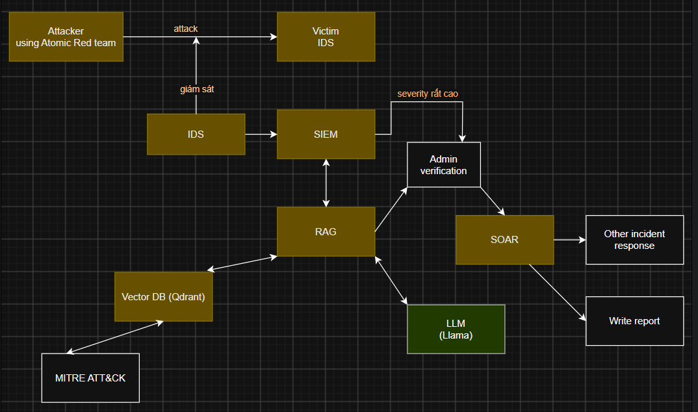
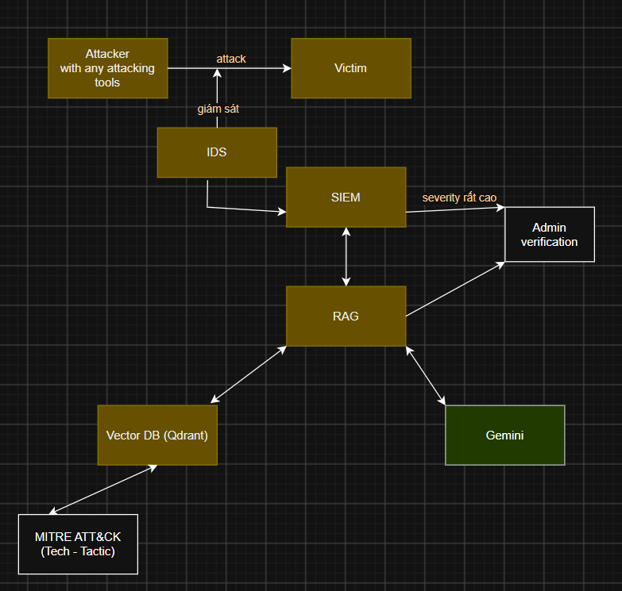
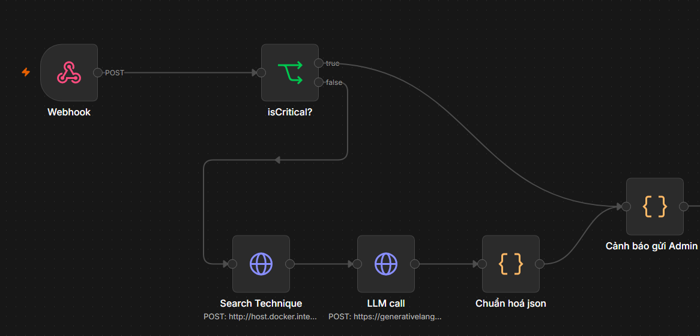
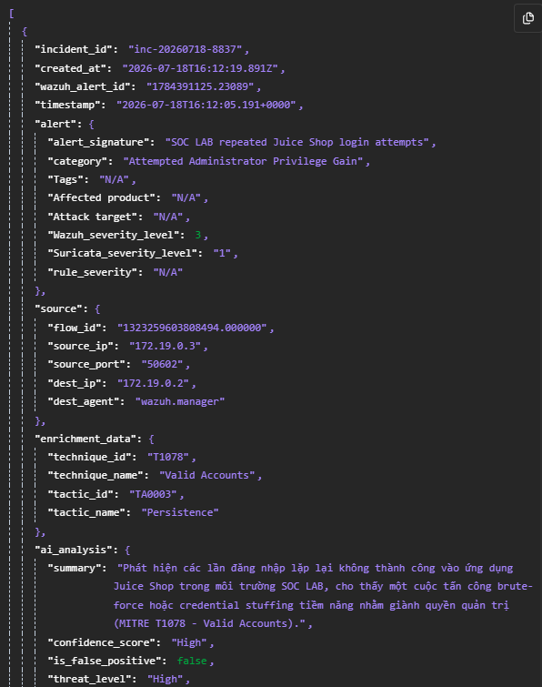
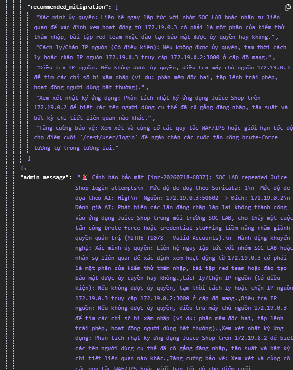
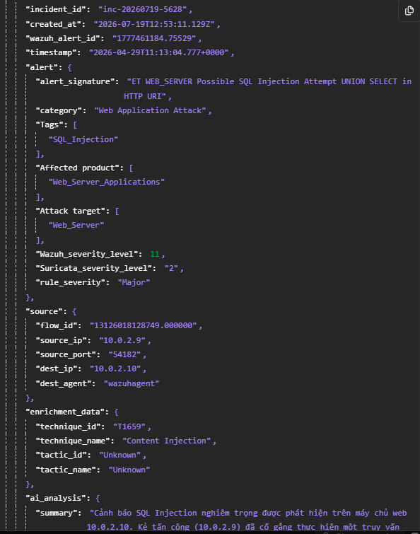
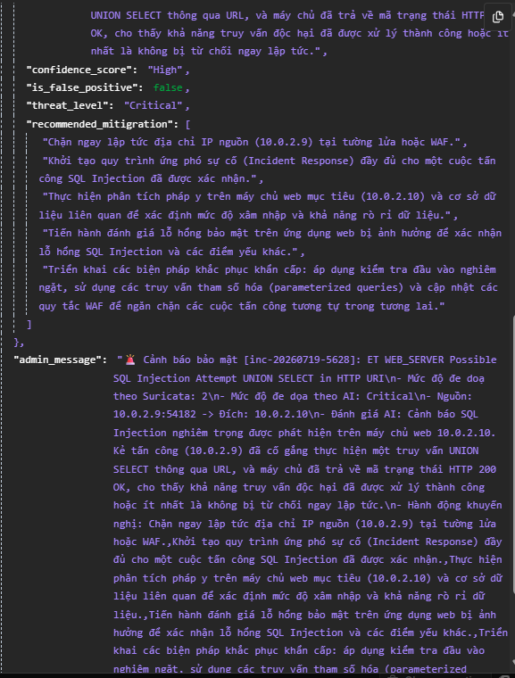

# NCKH - Báo cáo về sản phẩm MVP

Mô tả: Báo cáo
Trạng thái: Khác

<aside>
ℹ️

**Chú thích:**

A: Mô hình sản phẩm hoàn thiện của dự án

A1: Mô hình MVP chúng em đã xây dựng được

</aside>

## 1. Đặt vấn đề và mục tiêu phát triển

- Giới thiệu mô hình A
    
    
    
    - Mô tả hệ thống:
        - IDS đóng vai trò giám sát và phát hiện tấn công mạng
        - Cảnh báo của IDS được gửi về SIEM
        - SIEM gửi cảnh báo vừa nhận được cho hệ thống RAG qua Webhook, cơ chế PUSH
        - RAG tiến hành làm giàu (truy vấn DB Qdrant) và yêu cầu LLM đánh giá tấn công.
        - RAG chuẩn hoá kết quả thu được, tạo nội dung (message) gửi cho Admin để phê duyệt
        - Sau khi Admin phê duyệt, quá trình phản ứng của SOAR đằng sau sẽ được thực hiện
    - Đầu vào:
        - Các tấn công kiểm thử thực hiện tới máy Victim bằng công cụ [Atomic Red Team](https://github.com/redcanaryco/atomic-red-team) và các công cụ tấn công phổ biến khác (Nmap, SQLmap)
    - Đầu ra
        - Kết quả nhận định về cảnh báo tấn công, và các đề xuất do LLM tạo.
        - Tin nhắn cảnh báo gửi tới Admin (→ Admin verification)
        - Các phản ứng của SOAR tương ứng hành vi tấn công đó.
    - Các công nghệ sử dụng
        - Tạo môi trường ảo: Docker
        - IDS: Suricata, bộ luật ET rules và các luật custom
        - SIEM: Wazuh
        - RAG: Database Qdrant + mô hình embedding của Hugging face - ATTCK BERT
        - LLM (dự kiến): LLM local Llama.
        - Điều phối quá trình và SOAR: n8n
- Phương pháp đánh giá sản phẩm:
    - Đánh giá mức độ chính xác của kết quả mapping Technique, và các đánh giá, phản ứng của toàn bộ mô hình trước cuộc tấn công.
- *Nguyên nhân chuyển sang làm mô hình A1*
    
    *Để tối ưu thời gian, tài nguyên, và giảm thiểu rủi ro từng giai đoạn, chúng em quyết định xây dựng mô hình **MVP** A1 (ở phần 2). Mô hình này tập trung nhiều vào thành phần cốt lõi: Xử lý Pipeline RAG làm giàu cảnh báo (kết hợp Wazuh, Qdrant và MITRE ATT&CK BERT). Việc tạm thời lược bỏ và đơn giản hoá các thành phần khác nhằm dồn nguồn lực vào các thành phần cốt lõi trên, đồng thời có thời gian để nhận xét, sữa lỗi và tối ưu chúng trước khi tiếp tục với các thành phần khác để tránh quá tải. Đây là một **Proof of Concept (PoC)** giúp cô lập và kiểm chứng tính khả thi của luồng dữ liệu quan trọng nhất.*
    

## 2. Chi tiết về sản phẩm A1

- Sơ đồ mô tả hệ thống của A1:
    
    
    
- Sơ đồ hệ thống được cài trong n8n:
    
    
    
- Phần tấn công, giám sát và chuyển cảnh báo
    - **Môi trường kiểm thử và đối tượng giám sát:** Mô hình được triển khai bằng Docker. Ứng dụng web OWASP Juice Shop đóng vai trò máy đích (Victim) và được truy cập thông qua Nginx Gateway. Suricata được đặt cùng không gian mạng với Gateway để quan sát lưu lượng đi vào ứng dụng; các sự kiện mạng được ghi dưới định dạng EVE JSON. Cách bố trí này giúp tách biệt môi trường kiểm thử khỏi máy cá nhân, đồng thời bảo đảm các hành vi tấn công chỉ được thực hiện trong phạm vi phòng thí nghiệm.
    - **Kịch bản tạo cảnh báo:** Nhóm thực hiện các tình huống phổ biến đối với ứng dụng web gồm quét cổng bằng Nmap, đăng nhập lặp lại với thông tin xác thực sai (brute-force) và truy vấn có dấu hiệu SQL injection. Với brute-force, các yêu cầu POST được gửi tới API đăng nhập của Juice Shop theo nhịp độ có kiểm soát; ứng dụng trả về mã HTTP 401 cho các lần xác thực không thành công. Việc kiểm thử chỉ sử dụng tài khoản và mật khẩu giả trong môi trường lab, không thực hiện trên hệ thống bên ngoài.
    - **Phát hiện tại lớp IDS:** Suricata sử dụng tập luật Emerging Threats kết hợp luật tự xây dựng cho Juice Shop. Luật custom theo dõi số lần gọi lặp lại tới đường dẫn `/rest/user/login` trong một khoảng thời gian xác định; khi vượt ngưỡng, Suricata tạo sự kiện alert với chữ ký `SOC LAB repeated Juice Shop login attempts`, nhóm `Attempted Administrator Privilege Gain` và mức độ nghiêm trọng của Suricata là 1. Các thông tin như IP nguồn/đích, cổng, URL, phương thức HTTP, mã phản hồi và chữ ký cảnh báo đều được lưu trong `eve.json`.
    - **Thu thập và chuẩn hoá tại SIEM:** Wazuh Manager theo dõi liên tục tệp `eve.json`, giải mã bản ghi JSON và áp dụng bộ luật Suricata của Wazuh. Từ alert của Suricata, Wazuh tạo cảnh báo chuẩn hoá có rule ID `86601`, mức cảnh báo 3 và nhóm `ids`, `suricata`. Cảnh báo được lưu tại `alerts.json`, lập chỉ mục để hiển thị trên Wazuh Dashboard và giữ lại đầy đủ ngữ cảnh mạng để phục vụ điều tra.
    - **Chuyển cảnh báo sang n8n:** Khi alert đạt ngưỡng đã cấu hình, custom integration `custom-n8n` của Wazuh gửi HTTP POST tới Webhook của workflow n8n. Payload được đóng gói theo cấu trúc `_source` để tương thích với dữ liệu Wazuh trên OpenSearch, bao gồm ID cảnh báo, thời điểm phát hiện, thông tin rule, agent và trường `data` của Suricata. n8n xác nhận nhận webhook và tạo một execution cho workflow; do đó cảnh báo được chuyển ngay sang bước làm giàu MITRE ATT&CK và phân tích ở các node tiếp theo.
    - **Kết quả kiểm thử luồng cảnh báo:** Trong kịch bản brute-force, Suricata đã sinh alert sau chuỗi đăng nhập sai; Wazuh tiếp nhận và sinh alert level 3; workflow n8n nhận payload và hoàn tất execution ở trạng thái `success`. Kết quả này xác nhận luồng dữ liệu từ lớp phát hiện đến lớp điều phối hoạt động theo cơ chế PUSH, là cơ sở để tích hợp phần RAG, LLM và SOAR trong các giai đoạn tiếp theo.
- Phần lấy thông tin MITRE ATT&CK và prompt Gemini
    
    Công nghệ RAG được sử dụng để gán các cảnh báo tấn công với mã Technique và Tactic tương ứng trong MITRE ATT&CK, bao gồm:
    
    - **Mô hình CSDL Vector Qdrant**: Nơi chứa dữ liệu về các Technique của MITRE ATT&CK có thể bị phát hiện bằng IDS. Việc truy vấn sử dụng **tìm kiếm kết hợp (Hybrid)**, bao gồm tìm kiếm ngữ nghĩa (Semantic Search) và tìm kiếm theo từ khoá(BM25)
    - **Mô hình nhúng (embedding) hugging face - ATTCK BERT**: Để vector hoá các thông tin về các Technique, và truy vấn đầu vào, phục vụ cho quá trình tìm kiếm.
    
    Toàn bộ quá trình từ làm giàu thông tin MITRE đến gọi API Gemini được điều phối bởi n8n Workflow theo thứ tự:
    
    - Log cảnh báo —> Tìm kiếm Technique qua Node **[Search Technique]** —> Technique ID
    - Log cảnh báo + Technique ID —> Gọi LLM **[LLM Call]** —> Nhận định và giải pháp đề xuất của LLM
    - Chuẩn hoá đầu ra của LLM
    - Tạo nội dung tin nhắn cảnh báo để gửi cho Admin qua Telegram
- Kiểm thử và kết quả của mô hình
    - Với tấn công Brute-force
        
        
        
        
        
    - Với tấn công SQLi
        
        
        
        
        

## 3. Những điểm nâng cấp dự kiến của sản phẩm A so với A1

- Về LLM: Nhóm em đang cân nhắc giữa 2 lựa chọn: Sử dụng API thương mại (Gemini API) và Triển khai mô hình cục bộ (Local LLM)
    
    
    | **Tiêu chí đánh giá** | **Phương án API Thương mại (Gemini)** | **Phương án Local LLM (Llama 3)** |
    | --- | --- | --- |
    | **Năng lực suy luận & Tri thức** | **Rất cao:** Khả năng hiểu ngữ cảnh bảo mật và đề xuất giải pháp chính xác hơn | **Trung bình:** Khả năng hiểu và suy luận hạn chế hơn đối với các kịch bản tấn công phức tạp. |
    | **Cửa sổ ngữ cảnh (Context)** | **Rất lớn:** Thoải mái phân tích chuỗi log dài và tài liệu chuyên sâu. | **Hạn chế:** Dễ bị tràn ngữ cảnh khi cần phân tích lược sử log hệ thống lớn. |
    | **Chi phí đầu tư ban đầu (CAPEX)** | **Thấp:** Không tốn chi phí mua sắm hoặc thuê hạ tầng VPS đắt đỏ ở giai đoạn đầu. | **Cao:** Đòi hỏi đầu tư hạ tầng phần cứng (VPS, ưu tiên có GPU chuyên dụng) để vận hành mô hình mượt mà. |
    | **Chi phí vận hành (OPEX)** | **Biến động theo lưu lượng:** Chi phí tăng tuyến tính theo số lượng log/alert đẩy lên hệ thống. | **Cố định:** Chi phí thuê/bảo trì cố định, không phụ thuộc nhiều vào số lượng alert xử lý. |
    | **Khả năng mở rộng (Scalability)** | **Tự động mở rộng:** Đáp ứng tốt khi cẩn mở rộng về hạ tầng giám sát và lượng cảnh báo | **Phụ thuộc phần cứng:** Dễ bị nghẽn hệ thống nếu lượng alert vượt quá khả năng. |
    | **Bảo mật dữ liệu (Privacy)** | **Rủi ro trung bình:** Dữ liệu log nội bộ phải đẩy lên Cloud của bên thứ ba. | **Tuyệt đối:** Dữ liệu hoàn toàn lưu giữ trong hạ tầng nội bộ, đảm bảo tính bí mật về dữ liệu. |
- Về SOAR: Nhóm em xem xét thêm SOAR. SOAR sẽ được khởi chạy sau khi Admin phê duyệt cảnh báo bảo mật, và gồm các chức năng như:
    - Viết báo cáo sự cố
    - Tự động cách li thiết bị, chặn IP truy cập
    - <Diệp viết tiếp>

## 4. Các câu hỏi

- Về LLM, chúng em nên tiếp tục sử dụng API thương mại hay tự cài đặt mô hình LLM local?
- Nếu tự cài đặt LLM Local, chúng em có thể tham khảo mô hình LLM nào đã được tinh chỉnh phù hợp với context của An toàn thông tin nói chung, và MITRE ATT&CK nói riêng ạ?
- Mô hình truy vấn technique MITRE ATT&CK  của chúng em hiện tại sử dụng:
    - So sánh vector ngữ nghĩa
    - Tìm từ khớp theo BM25.
    - Tạo nhiều bộ lọc technique theo thông tin trên cảnh báo (VD: Có “SQLi → nằm trong Tactic Initial Access)
    
    Tuy nhiên độ chính xác của những truy vấn này vẫn chưa đạt như kì vọng. Mong thầy có thể gợi ý những giải pháp để tăng độ chính xác của mô hình ạ?